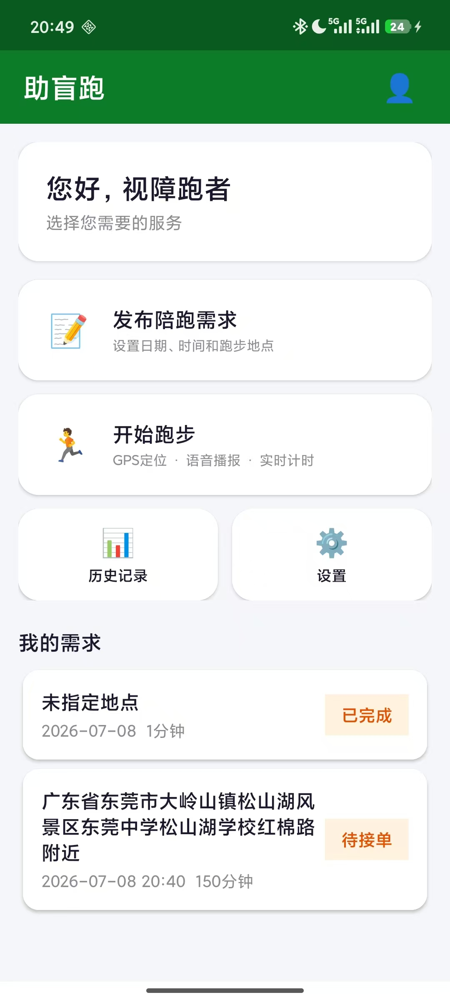
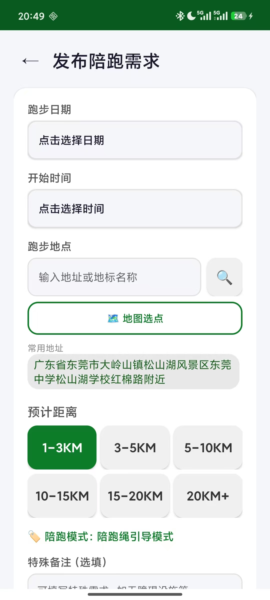
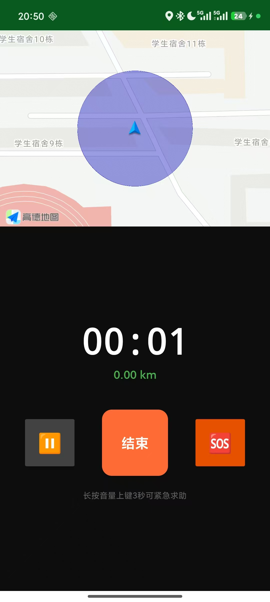
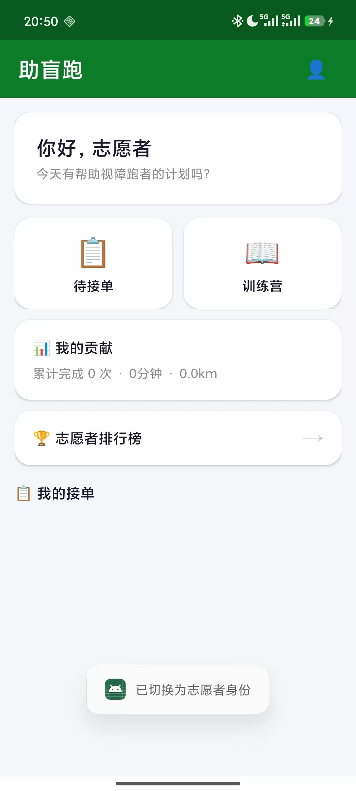

# 助盲跑 BlindRunner

> 面向视障跑者与陪跑志愿者的公益无障碍跑步助手

**小组成员：** 袁纪欢 2023463030735 &nbsp;|&nbsp; 刘绍滨 2023463030720

---

## 项目简介

助盲跑是一款专为**视障人士**与**陪跑志愿者**设计的 Android 原生应用，核心解决三个问题：

1. **需求匹配** — 视障用户发布陪跑需求（时间/地点/距离），志愿者浏览并接单
2. **跑步安全** — 30秒语音口令播报 + 长按音量上键3秒一键紧急拨号
3. **志愿者培训** — 4节陪跑绳规范课程 + 10道判断题在线考核（80分通过方可接单）

**技术栈**：Kotlin · Room (SQLite) · Retrofit · Kotlin Coroutines · 高德地图 SDK · TextToSpeech · Foreground Service · AccessibilityService

---

## 运行环境

| 项目 | 要求 |
|------|------|
| 最低 Android 版本 | **Android 8.0 (API 26)** |
| 目标 Android 版本 | Android 14 (API 34) |
| 开发环境 | Android Studio Hedgehog (2023.1+) |
| JDK | 17 |
| Gradle | 8.5 |
| 地图服务 | 高德地图 SDK 10.0.600 |

---

## 快速开始

### 1. 克隆项目
```bash
git clone https://github.com/lll8488/GuideRun-Android.git
cd GuideRun-Android
```

### 2. 用 Android Studio 打开项目
- File → Open → 选择项目根目录
- 等待 Gradle Sync 完成

### 3. 编译运行
- 连接 Android 手机（开启 USB 调试）或启动模拟器
- Build → Build APK(s) 生成 APK
- 或直接点击 Run 按钮安装到设备

### 4. 测试账号
| 角色 | 手机号 | 说明 |
|------|--------|------|
| 视障用户 | 17825322628 | 预置账号，可直接登录 |
| 志愿者 | 任意 11 位手机号 | 注册后选择志愿者身份，需通过考核 |

> 登录/注册均使用模拟验证码，任意6位数字即可。

---

## APK 下载

最新 Debug APK：[📦 下载 app-debug.apk](./apk/app-debug.apk) *(23 MB, 2026-07-03)*

---

## 核心功能截图

| 视障用户首页 | 发布陪跑需求 | 跑步模式 | 志愿者端 |
|:---:|:---:|:---:|:---:|
|  |  |  |  |

---

## MVP 功能清单

### 一、双身份用户体系
- [x] 手机号 + 验证码注册 / 登录
- [x] 首次登录强制选择「视障用户」/「陪跑志愿者」身份
- [x] 个人中心信息编辑 + 紧急联系人设置（最多3位）
- [x] 身份切换功能（切换后直接跳目标首页）

### 二、陪跑规范学习与考核
- [x] 4节陪跑绳规范图文 + 语音课程（TextToSpeech 全量播报）
- [x] 10道判断题在线考核（每题10分，80分通过）
- [x] 未通过者接单按钮置灰，提示「请先通过考核」
- [x] 考核结果永久存储（SharedPreferences + SQLite）

### 三、需求发布与匹配
- [x] 发布需求：日期 / 时间 / 地点（文字输入或地图选点）/ 距离区间
- [x] 陪跑模式固定「陪跑绳引导模式」标签
- [x] 发布前二次语音确认弹窗
- [x] 需求列表按时间倒序 + 距离筛选 + 关键词搜索
- [x] 需求详情含大字地址、静态地图（约300×200dp）、导航按钮
- [x] 接单二次确认，双方联系方式互见

### 四、跑步语音辅助与记录
- [x] 跑步模式前后台保活（Foreground Service + 通知栏常驻「助盲跑进行中」）
- [x] 屏幕常亮（FLAG_KEEP_SCREEN_ON）
- [x] 30秒语音口令播报（默认间隔，可调 15/30/60 秒，可关闭）
- [x] 长按音量上键 3 秒一键拉起紧急拨号盘（不自动拨号）
- [x] 跑步记录自动生成 → 历史查询（日期筛选）→ 长按删除
- [x] 统计页面：总次数、总时长、平均时长、总距离 + GraphView 折线图

---

## 项目目录结构

```
claudecode/
├── app/                                  # Android 客户端模块
│   ├── build.gradle.kts                  # 依赖配置
│   └── src/main/
│       ├── AndroidManifest.xml           # 权限 + Activity/Service 注册
│       ├── java/com/blindrunner/app/
│       │   ├── BlindRunnerApp.kt         # Application 入口
│       │   ├── MainActivity.kt           # 旧版测试页
│       │   ├── base/
│       │   │   └── BaseActivity.kt       # 基类（导航/弹窗/错误处理）
│       │   ├── data/
│       │   │   ├── local/                # Room 数据库
│       │   │   │   ├── AppDatabase.kt    # 数据库定义 + Migration
│       │   │   │   ├── dao/              # 数据访问对象
│       │   │   │   └── entity/           # 数据库实体
│       │   │   ├── remote/               # Retrofit 网络层
│       │   │   │   ├── RetrofitClient.kt # 网络客户端配置
│       │   │   │   ├── api/ApiService.kt # API 接口定义
│       │   │   │   └── model/            # 网络请求/响应模型
│       │   │   └── repository/           # 数据仓库
│       │   ├── domain/model/             # 领域模型
│       │   ├── service/
│       │   │   ├── RunningService.kt     # 跑步前台 Service
│       │   │   └── EmergencyAccessibilityService.kt  # 紧急求助无障碍服务
│       │   ├── ui/
│       │   │   ├── auth/                 # 登录/注册/身份选择
│       │   │   ├── blind/               # 视障用户端（8个页面）
│       │   │   ├── volunteer/           # 志愿者端（6个页面）
│       │   │   ├── splash/              # 启动页
│       │   │   └── main/                # ViewModel
│       │   └── util/                     # 工具类
│       │       ├── TtsHelper.kt          # 语音合成（无障碍核心）
│       │       ├── AppPrefs.kt           # SharedPreferences 管理
│       │       ├── NotificationHelper.kt # 通知管理
│       │       ├── ThemeHelper.kt        # 主题切换
│       │       ├── MapConfig.kt          # 地图 Key 统一管理
│       │       └── Logger.kt             # 日志工具
│       └── res/
│           ├── layout/                   # 25+ 个 XML 布局文件
│           ├── drawable/                 # 按钮/标签样式
│           ├── values/                   # 字符串/主题/颜色
│           └── xml/                      # 网络配置/无障碍配置
├── server/                               # Ktor 后端服务（已写待部署）
│   ├── build.gradle.kts
│   └── src/main/kotlin/com/blindrunner/server/
│       ├── Application.kt               # 入口（端口 8080）
│       ├── Database.kt                  # H2 数据库 + 建表
│       └── Routing.kt                   # 12 个 RESTful API 端点
├── build.gradle.kts                      # 根构建配置
├── settings.gradle.kts                   # 模块注册
├── gradle.properties                     # Gradle 属性
└── README.md                             # 本文件
```

---

## 无障碍适配

本应用面向视障用户，做了以下无障碍适配：TTS语音导航覆盖所有页面切换和按钮操作；所有可交互控件设置了 contentDescription；适配 TalkBack 焦点顺序；提供高对比度黑白主题；支持系统大字体（sp 单位）；紧急操作配有语音+震动双重反馈。

---

## 安全设计

- 紧急求助只拉起拨号盘，不自动拨号
- 位置权限在需要用到地图选点时才申请
- 志愿者需考核通过（≥80分）才能接单
- 高德地图API Key统一放在MapConfig管理

---

## 演示视频

📺 [助盲跑 MVP 功能演示（百度网盘）](https://pan.baidu.com/s/1YrF6wlgZS93uOYCMoYmUsw?pwd=9reu)  
提取码：`9reu`

> 内容（2分钟内）：
> 1. 登录 → 选择身份 → 进入首页
> 2. 发布陪跑需求（含地图选点）
> 3. 志愿者端浏览需求 → 接单
> 4. 开始跑步 → 30 秒语音播报 → 结束 → 查看记录

---

## 许可证

本项目为课程作业项目，仅供学习交流使用。
